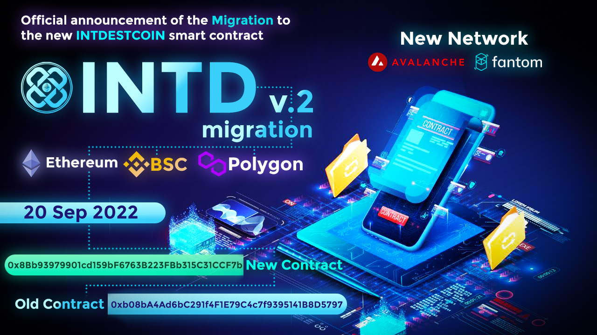

# 
# 
# Immigration-contract
INTDESTCOIN is an ecosystem that validates value for anything, anywhere. It has enabled the validation of any digital content with no geographic location restrictions.

> INTDESTCOIN  is a solution to the evolution of the Blockchain world

### INTD: 
To create an integrated financial ecosystem for INTDEST services that includes but is not limited to short selling and hedging tools, an optimized [trading](https://coinmarketcap.com/alexandria/glossary/spot-trading) algorithm from global investors, and [Cryptocurrency](https://coinmarketcap.com/alexandria/glossary/cryptocurrency) [exchange](https://coinmarketcap.com/alexandria/glossary/exchange) using the most popular payment tools.

## What is the reason behind INTD?
* Creating a platform for synchronizing INTDEST services
* The communication [bridge](https://coinmarketcap.com/alexandria/glossary/bridges) of data and information between users, INTDEST services
* Providing [payment](https://coinmarketcap.com/alexandria/glossary/funding-payments) for INTDEST services
* Creating equal shares for users in INTDEST services
Use for governance credentials to identify how network resources are [allocated](https://coinmarketcap.com/alexandria/glossary/allocation)
* Holding and profiting from [staking](https://coinmarketcap.com/alexandria/glossary/staking-pool) INTD
* Receive commission during transfer between XCHAIN network in addition to [STAKE](https://coinmarketcap.com/alexandria/glossary/staking-pool)
